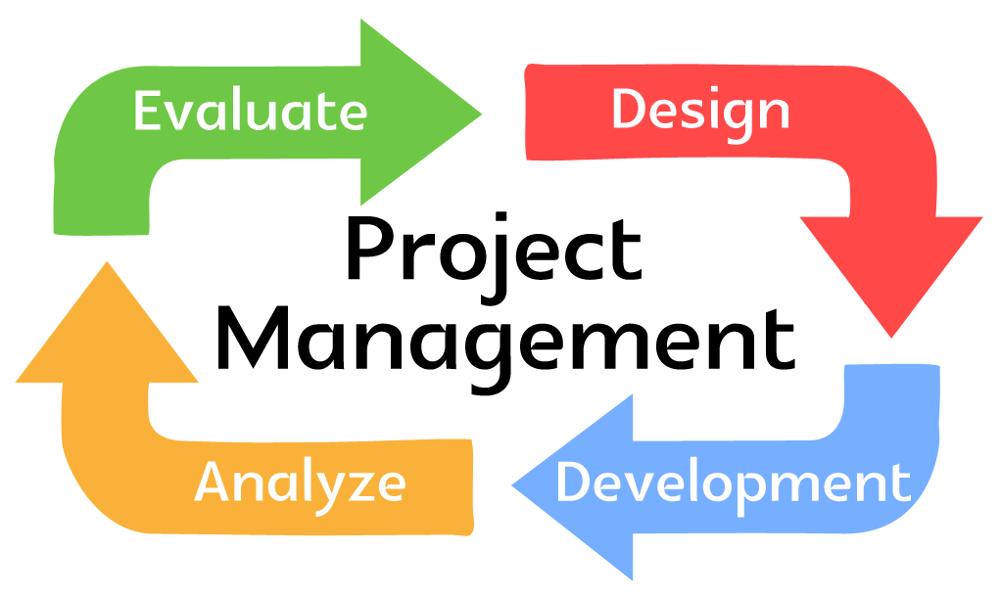

# Hi, I'm Sunil! 👋

## 🚀 About Me
* I am a `Data Scientist`, a seasoned `Business Analyst`, and a `Change Leader`. 
* I have expertise in the capital markets domain, specializing in securities trading,  post-trade processing, and security operations.
* I am passionate, constantly experimenting and learning about everything "Data" and related disciplines of `Data Analysis`, `Machine Learning`, and `Deep Learning`
* I hold a `Bachelor of Engineering Degree (BE)` in `Computer Science`, `Post Graduate Diploma (PGD)` in `Data Science`, and `Master of Science (MS)` degree in `Data Science`

## 🛠 Skills

  &nbsp;&nbsp;
  &nbsp;&nbsp; 
  

  
  &nbsp;&nbsp; 
  &nbsp;&nbsp;
  &nbsp;&nbsp;
  &nbsp;&nbsp;
  &nbsp;&nbsp;
  &nbsp;&nbsp;
  
  
  

  &nbsp;&nbsp;
  &nbsp;&nbsp; 
  &nbsp;&nbsp;

## 📈 Stats

